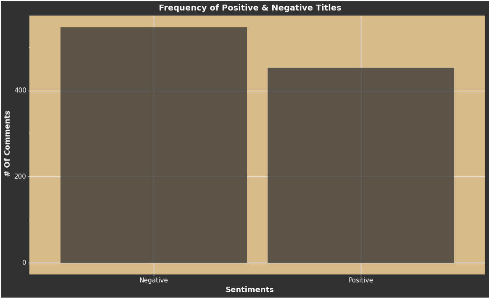

# DATA 340: NLP Course Project

## Abstract:

This project analyzes the sentiment of named entities gathered from the top 1,000 [r/NBA](https://www.reddit.com/r/nba/) posts from the past year. The goal of this project is to identify which players and teams get the most attention and if that focus by the community is in mostly negative or positive ways. This project will give a better understanding of the opinions the NBA community as a whole has on the different aspects of the NBA. The data set I generated contains the top 1,000 posts from the past year starting from 3/11/2022 to 3/11/2023. For each post, there are ten comments saved as list. With this dataset, I used the transformers' library to extract the named entities of each post’s title and comments. In addition, I used the transformers' sentiment analysis function to identify if a post title and each comment had a positive or negative sentiment. This gives a general view of if the named entities in the comments and titles are being talked about in a positive or negative manner in most situations. With this information, I generated a variety of graphs to visualize the findings for the titles and comments. The main finding of this project is that the majority of titles and comments are negative in sentiment. In addition, the player with the most negative posts was Kyrie Irving. Future work can identify the most frequent words used to describe these players and how related they are.

## Introduction:

In this project, I hope to better understand how fans talk about the NBA including its players and teams. I gathered this data from the subreddit [r/NBA](https://www.reddit.com/r/nba/). This subreddit is a place for users to discuss a wide range of topics about the NBA including post game thoughts, news around players, and more. I have a long list of questions to better understand the discourse around the teams and players. What players do users discuss the most frequently? Are the players who are mentioned the most talked about favorably or unfavorably? Are there players who are talked about disproportionally to their impact on the court? What team is talked about the most? Conversely, which teams are talked about the least frequently? This list of questions is long sprawling and likely to expand throughout the project. My desire to answer these questions stems from my love of the NBA as well as the conversations and discourse around it. I know that the broader community and I have certain perspectives on how that discourse is shaped, but I am curious if these assumptions match up with the truth. It is possible that others and I only see a fraction of the opinions fans share and there is a whole group that has different views than we do. I want to uncover these opinions and have a better understanding of the feelings of NBA community as a whole. Answering these questions will give a better understanding of how the NBA community on Reddit feels and discusses its components. Additionally, this information could spur additional research and provide insight for the NBA as a whole to understand how people view their product. Gathering this information could additionally inform future marketing or operating policies.

## Methodology/Dataset:

To generate the dataset for this project, I used the [Python Reddit API Wrapper (PRAW)](https://github.com/reddit-archive/reddit/wiki/API). The dataset contains 1,000 rows that represents the top 1,000 posts from the past year, starting from 3/11/2022 to 3/11/2023. For each of those 1,000 posts, the top 10 comments are saved as a list. If the post has body text, that is saved as a string. Some posts do not have body text, especially if the original post was sharing a media file such as a tweet or video. All of this information was then saved to a csv file which can be obtained [here](data/nba_reddit_threads_data.csv). The code used to generate the data set can be found in this [notebook](project_notebooks/data_set_creation.ipynb). Additional information about the data set can be found [here](data_set_creation.md).

For my analysis, I loaded the generated dataset into a python notebook. I first looked at the 10,000 comments I gathered. To identify the Named Entities, I used the pipeline function from the Transformers library. For each comment, I generated the Named Entities and saved the selected words. This gave me a list of named entities for each of the comments which I could do later analysis. For each comment, I additionally passed it through the Sentiment Analysis pipeline from the Transformers library. This gave a label of positive or negative for each comment. With this information, I could identify the players and teams as well as the way that they were being talked about. I repeated this process for the titles of each post. Once I had the named entities and the sentiments, I moved onto visualizing my findings.

For graphing the findings, I used Plotnine which is based on ggplot2. This gave me fine-grained control over every aspect of the graphs. The main visualizations I made were bar graphs that identified the highest frequency counts of named entities, the proportion of positive and negative comments/titles, the entities with the largest amount of negative sentiments, the entities with the highest proportion of negative sentiments, the entities with the largest amount of positive sentiments, and the entities with the highest proportion of positive sentiments. These visualizations gave a good understanding of the recurring entities with generally negative or positive views from the community.

## Results:

The results of the methodology are best shown in each of the graphs below. They are broken into major categories: the entities from the post comments and the entities from the post titles. Within each of these groups, I looked at the top 25 entities based on their frequency, the proportion of negative and positive sentiments, the count of negative and positive sentiments for each entity, and the percentage of negative and positive sentiments for each entity. I did not look at the entity counts for the titles since it was a smaller sample size and matched the results of the percentages.

### Top Named Entities For Comments & Titles

This graphs shows the top 25 entities from the comments based on their count frequency. Unsurprisingly, the NBA is the most talked about entity. The most popular players based on this metric was Kyrie Irving, Kevin Durant, Luka Dončić, Giannis Antetokounmpo, and LeBron James. The top teams were the Los Angeles Lakers, Golden State Warriors, Boston Celtics, and Brooklyn Nets.

This graph shows the top 25 entities from the titles of each post based on their count frequency. This distribution is roughly similar to the comment distribution. One major difference is Wojnarowski and ESPN being so high. This is because Adrian Wojnarowski is a reporter from ESPN who is often mentioned as the main source for all breaking news in the titles. He does not appear in the comments as much because they are referring to the contents of the story instead of the reporting.

### Split of Positive & Negative Sentiments for Comments & Titles

Both of these graphs examine the distribution of sentiments. The first graph looks at the comments and the second looks at the titles. The overwhelming takeaway is that r/NBA posts which are most upvoted are a majority of the time negative.

### Most Positive & Negative Entities for Comments

#### Negative Comments

This graph looks at the entities that have the highest count of negative comments. The distribution of the counts almost perfectly lines up with the baseline frequency. This is not too surprising since we saw that the majority of comments skew negative and that entities talked about more are therefore more likely to have more negative sentiment counts. To counteract this, I looked at the percentage of negative comments in the next graph.

This graph looks at the entities that have the highest percentage of negative comments. This means of the total amount of times this entity appeared, what percent of the time was the comment negative. By being percentages instead of counts, the distribution is much less skewed and show more entities that do not have very high baseline counts. The main takeaways are that Jordan Poole, Kawhi Leonard, Skip Bayless, Kevin Durant, and Ben Simmons are the players with the highest percentage of negative comments. Skip Bayless stands out because he is a TV personality while the others are all players. As a note, the entity that is blank represents the stories that had no recognizable named entities.

#### Positive Comments

This graph shows the entities with the highest count of positive comments. It is once again similar to the basic count graph. For this reason, the percentage graph is more helpful.

This graph looks at the entities with the highest percentage of positive comments. This means of the total amount of times this entity appeared, what percent of the time was the comment positive. The Dirk Nowitzki, Marcus Smart, Michael Jordan, Kareem Abdul-Jabbar, and Jayson Tatum. These results besides Marcus Smart and Jayson Tatum could show that players from past generations are talked about with more positivity than current day players. 

### Most Positive & Negative Entities for Titles

#### Negative Titles

This graph looks at entities with the highest percentage of negative titles. The leaders are Kyrie Irving, Draymond Green, Ben Simmons, Jordan Poole, and Ja Morant. 

#### Positive Titles

This graph looks at the entities with the highest percentage of positive titles. The leaders are Luka Dončić, Russell Westbrook, Stephen Curry, Nikola Jokic, and James Harden. These findings are surprising because I would have thought the consensus opinion for both Russel Westbrook and James Harden would be negative.

## Discussion:

## Conclusion:

The goal of this project was to identify the teams and players who were discussed the most frequently on the r/NBA subreddit. In addition, the project aimed to identify if these entities were discussed in a positive or negative light. This project identified that the majority of comments on the subreddit have a negative sentiment, and that the individual with the largest amount of negative comments and titles was Kyrie Irving. These findings are understandable since Kyrie Iriving and the Nets went through a variety of drama on and off of the court during the past year. This findings can provide information to the NBA to identify which players should be marketed more and which entities need help to change their general perception by the NBA community. Future research could identify the most common descriptors of each player as well as which players are grouped together most often based on their sentiments. This could further provide insight on the perception of the NBA and its players and teams.